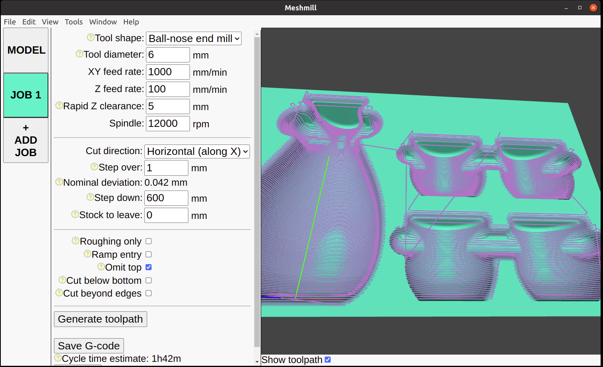

Meshmill is open source 3D CAM software for Linux.

***This is not even beta-quality software. Use it at your own peril.***

It aims to focus on:

 * ease of installation
 * ease of use
 * true 3D toolpaths, not 2.5D

At the expense of:

 * power
 * performance
 * high-quality toolpaths

I created Meshmill because I was frustrated with how difficult it was to get other open source
3D CAM software to work. Maybe once we have ease of use sorted we can address the rest.

Hopefully we've already ticked "ease of installation" and "true 3D toolpaths", which should
make it actually useful in some cases already.
To attack "ease of use", I want to add
"workflow hints" that point you to the next button you're likely to want to interact with, and
I want to add diagrams that make crystal clear what each setting is actually adjusting.

## Important stuff please read

* If you spot bugs and you want to help out, please
create a Github Issue, or send me an email if you're not on Github: james@incoherency.co.uk.

* Be careful with the generated G-code. Before running it, check that it's not going to crash your machine, break your tool, or
do anything else stupid. In particular, check the generated G-code in another application to satisfy yourself that the
paths are something close to what Meshmill rendered.

* If you use it to create some parts, please share pictures of your CAD and your final result :)

## How to use it

1. Download a release from the [Releases](https://github.com/jes/meshmill/releases) page.

2. `chmod +x meshmill-0.1.0.AppImage`

3. `./meshmill-0.1.0.AppImage`

4. Load your STL file in the "MODEL" tab.

5. Render the heightmap. You'll see that the model turns from your smooth triangle mesh into the blocky pixelated heightmap.
This is expected. If you reduce the "resolution" value you'll get a higher-quality heightmap, at the expense of CPU time.
You need to judge for yourself what level of precision is required for your particular part with your particular machine
and cutting tools.

6. Create a job with the "+ ADD JOB" button.

7. Set your cutting parameters and click "Generate toolpath". Once it is generated it will be displayed on
top of the model in purple.

8. Once you're happy with how your toolpath looks, use the "Save G-code" button to save it somewhere.

## Development

The GUI is made using Electron. The backend is Perl, using GD to handle images.

I recommend using [nvm](https://github.com/nvm-sh/nvm) to manage nodejs.

    $ nvm install --lts
    $ nvm use --lts

With nvm happy, clone the Meshmill repository and install its npm dependencies.

    $ git clone https://github.com/jes/meshmill
    $ npm install

And run the application.

    $ npm start

The backend for heightmap rendering and toolpath generation is [Pngcam](https://github.com/jes/pngcam).
There is a bundled version under `bin/`. There is also a bundled copy of [libgd](https://libgd.github.io/)
which is used by Pngcam, as well as a copy of Perl.

`main.js` is the Electron main process. `index.html` is the HTML loaded in the renderer process.

## Useful things to work on

If you want to improve Meshmill but don't know where to start, you could look at:

 * port Pngcam to Javascript so that it is more easily packaged for Windows
 * make Pngcam generate spiral toolpaths (or any others you find useful)
 * make Pngcam multi-threaded, or otherwise improve performance
 * implement support for rotary carving
 * an interesting example part to load up before the user opens their own model
 * some way to generate more than just top and bottom sides (maybe copy the part rotation UI that PrusaSlicer has?)
 * support for other tool shapes: tapered ball-nose end mills, bull-nose end mills, v-carving bits
 * include roughing calculations in the ETA of the processing time, because it's sometimes significant
 * skip "safe Z" moves where they're unnecessary
 * fix the thing where the camera moves to a new position when a new model is rendered (I think it re-positions so
   that it always looks at the centre of the model, don't know why)
 * orthographic view
 * adaptive toolpaths

## Contact me

Meshmill is created by James Stanley. You can email me at james@incoherency.co.uk or read my blog at
https://incoherency.co.uk/
